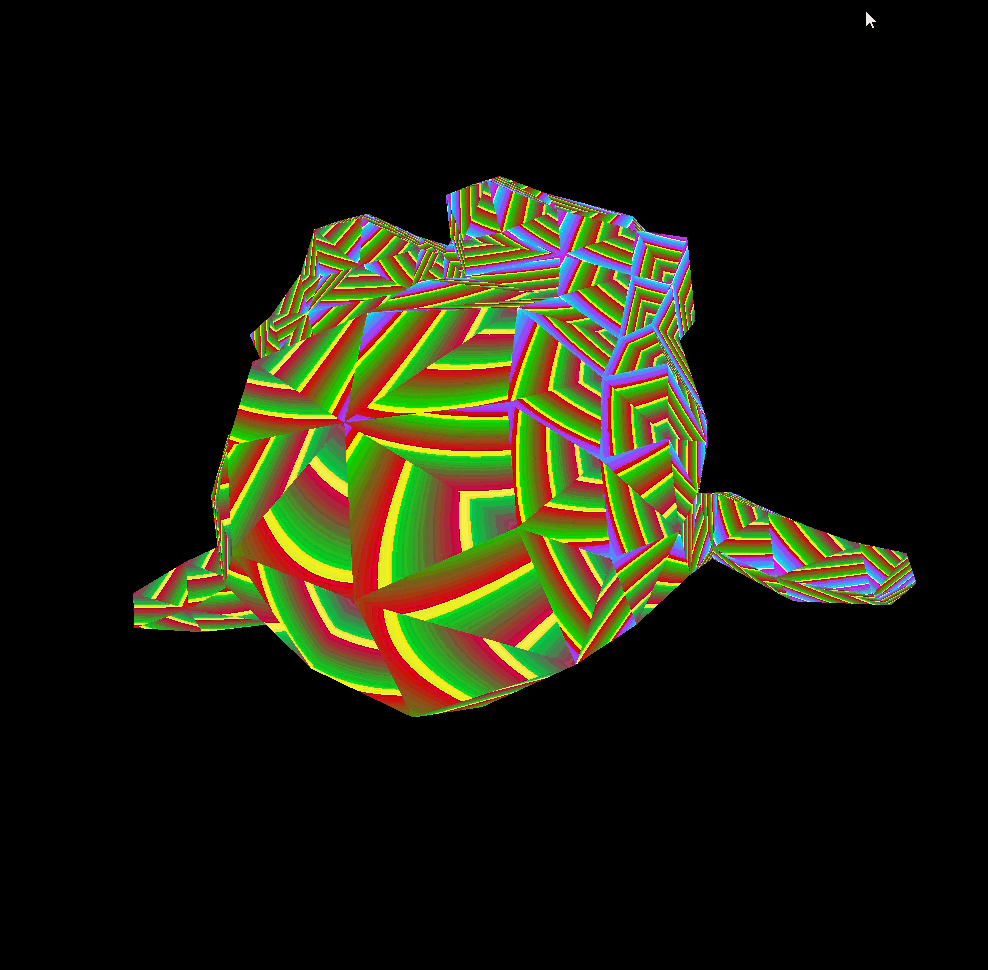

# FastEngine

FastEngine is a lightweight CPU-based renderer that performs rendering without external tools.

## Clone Instructions

```bash
git clone https://github.com/Alex-Sidor/FastEngine.git
```

## Build

* This project uses cmake

Create a build folder and build the project using CMake:

```bash
mkdir build
cmake -B build # -G "your generator"
cmake --build build
```

```bash
build/FastEngine (.exe)
```


